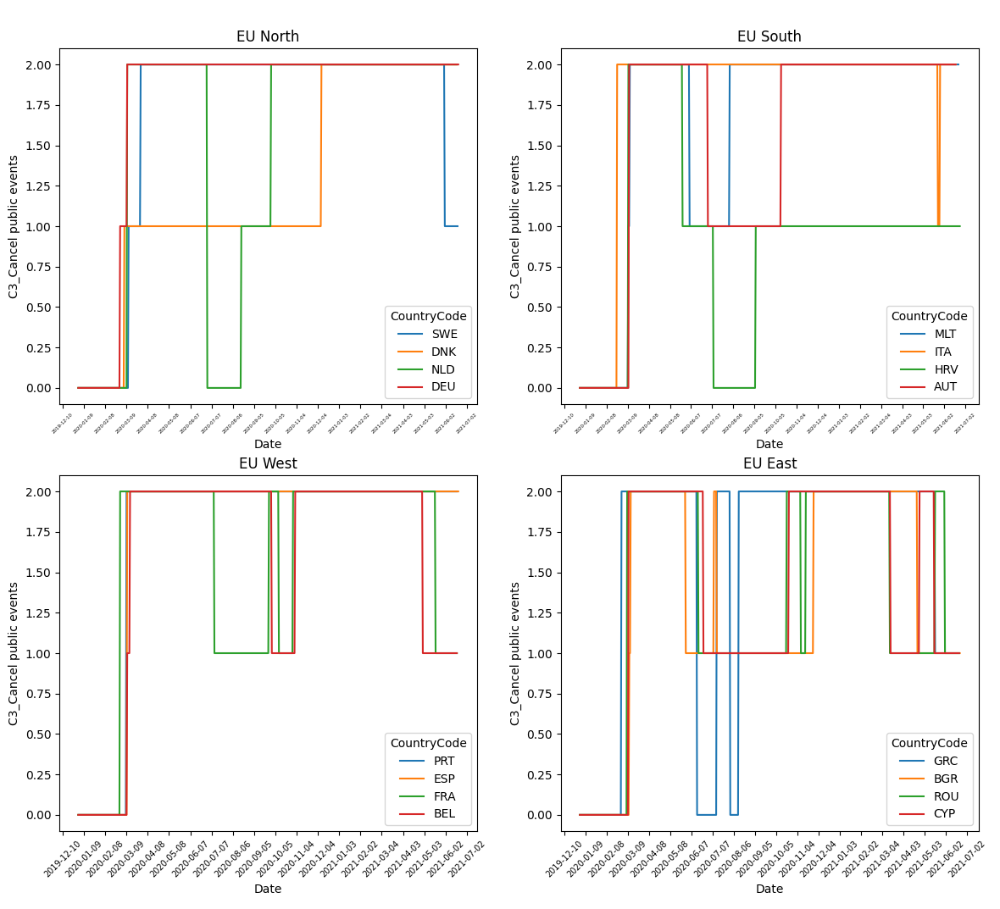

How to run the scripts
---------------------

- Create a new Python virtual environment:
    * Anaconda: `conda create --aimed python=3.7`
    * Unix: `python3 -m venv aimed python=3.7`
- Install the requirements: `pip install -r requirements.txt`
- Make sure the dataset is downloaded & placed in a folder named *data* in the relative project's path.

Visualization
-------------
For he Oxford Covid-19 Government Response Tracker [OxCGRT](https://github.com/OxCGRT/covid-policy-tracker) dataset, two modes are implemented. 
- **mode**
    * **whole:** All European countries are taken into consideration.
    * **blocks:** 4 blocks with 4 countries each, containing countries from North, South, East and West Europe.
- **step**
    * An integer value representing the days between plotted data points. Default: 30 (~1 month)
- **target**
    * An integer value [0, 10] pointing to the list of available target **indicators**. See the code section and the dataset's interpretation [guide](https://github.com/OxCGRT/covid-policy-tracker/blob/master/documentation/interpretation_guide.md) for more information.  

- **Run:** `python visualize_EU.py -m block -t 2`
    * The above will visualize the dataset for the indicator *C3_Cancel public events* in block mode.

Extra
-----
Only 10 out of 20 indicators were used for this study. The rest can be added and explored by the interested user. 
